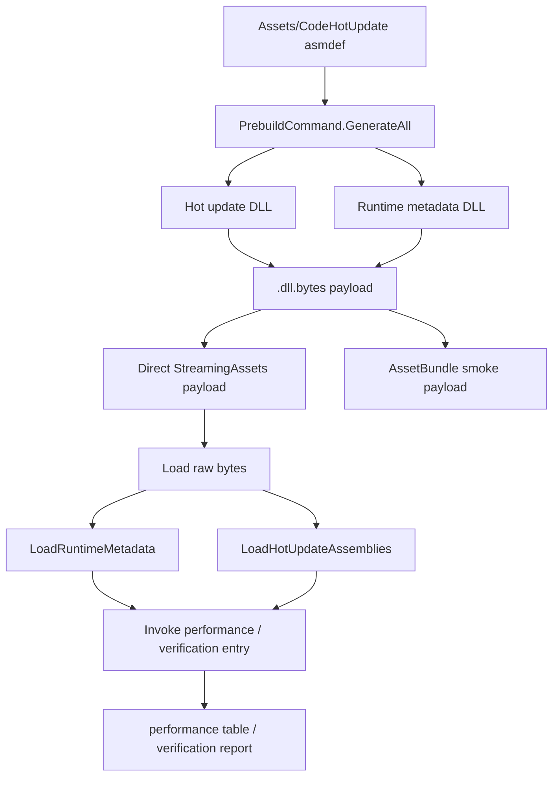

# Hotc233 Architecture

本文描述 Hotc233 在本工程中的完整链路：编辑器生成、二进制发布、运行时加载、自动化验证。

## 目标

Hotc233 目标是把 C# 热更新流程收束为一条可验证流水线：

```text
asmdef 热更代码
  -> 编辑器生成
  -> 热更 DLL
  -> .dll.bytes
  -> AssetBundle
  -> 运行时 byte[]
  -> 加载元数据
  -> 加载热更程序集
  -> 调用业务入口
```

核心原则：

- Unity 侧只认资源，不直接发布裸 `.dll`。
- 业务只依赖 Hotc233 运行时 API。
- 编辑器产物必须能被自动验证读回。
- 一键菜单和 CI 走同一条代码路径。

## 模块

```text
Hotc233.Runtime
  RuntimeApi
  HotUpdateBinaryLoader
  NamedBinary
  HomologousImageMode
  LoadImageErrorCode

Hotc233.Editor
  Settings
  Commands
  BuildProcessors
  AOT
  MethodBridge
  Meta
  Installer

UnityHotc.EditorForBuild
  Hotc233BuildAutomation

tools/hotc233ctl
  Go 1.26 batch runner
```

## 运行时层

`RuntimeApi` 是底层入口。非 Editor 平台通过 internal call 进入播放器运行时；Editor 下返回可测试桩，方便本地验证。

`HotUpdateBinaryLoader` 是上层易用封装：

1. 校验 `NamedBinary` 非空。
2. 调用 `RuntimeApi.LoadMetadataForAOTAssembly` 加载运行时元数据。
3. 调用 `Assembly.Load(byte[])` 加载热更程序集。
4. 保存已加载程序集。
5. 用 `InvokeStatic` 查找类型并调用静态入口。

调用顺序固定：

```text
LoadRuntimeMetadata(...)
LoadHotUpdateAssemblies(...)
InvokeStatic(...)
```

## 编辑器层

编辑器层负责把项目代码变成运行时可加载的二进制。

主要职责：

- 读取 Hotc233 设置。
- 收集热更 asmdef。
- 分析程序集依赖。
- 生成桥接代码。
- 生成链接保留配置。
- 复制裁剪后的元数据 DLL。
- 编译热更 DLL。
- 构建播放器时注入必要源码和配置。

当前工程用 `PrebuildCommand.GenerateAll(target, development, false)` 作为一键生成入口。

## 热更 asmdef 图

示例工程热更代码放在：

```text
Assets/CodeHotUpdate/
  Framework/
  Feature/
  Logic/
```

asmdef 图：

```text
Framework_HotUpdate
  -> Feature_HotUpdate
      -> HotUpdateLogic
```

自动验证会检查：

- 至少存在一个热更 asmdef。
- 必须存在 `Framework_HotUpdate`。
- 至少一个业务 asmdef 引用 `Framework_HotUpdate`。
- 每个热更 asmdef 位于独立目录。
- 加载顺序按依赖深度排序。

## 二进制资源层

生成后，热更 DLL 和运行时元数据复制到：

```text
Assets/EditorForBuild/Generated/Payload/
  HotUpdateDlls/
    Framework_HotUpdate.dll.bytes
    Feature_HotUpdate.dll.bytes
    HotUpdateLogic.dll.bytes
  RuntimeMetadata/
    mscorlib.dll.bytes
    System.dll.bytes
    System.Core.dll.bytes
    netstandard.dll.bytes
```

然后用 Unity `BuildPipeline.BuildAssetBundles` 构建：

```text
Library/EditorForBuild/AssetBundles/hotc233_binary_payload
```

功能和资源 smoke 可以从这个 AssetBundle 读回数据，证明发布形态真实可用。

WebGL / PC 的解释器性能表必须使用 direct StreamingAssets payload，避免把 AssetBundle、YooAsset 或下载耗时混进 hotc 执行性能：

```text
Assets/StreamingAssets/Hotc233Probe/Payload/
  payload-manifest.json
  HotUpdateDlls/*.dll.bytes
  RuntimeMetadata/*.dll.bytes
```

`hotc233ctl webgl` 会把这份 payload 打进 WebGL Player，浏览器只捕获热更性能 JSON，再与同平台原生 WebGL IL2CPP Player 对比并生成 `performance-webgl-local-il2cpp.md/json`。

## AppRoot 集成

`Assets/Code/AppRoot.cs` 演示运行时接入。

流程：

1. 初始化资源包。
2. 读取热更 manifest。
3. 加载元数据 `.dll.bytes`。
4. 加载热更 `.dll.bytes`。
5. 调用热更自测入口。
6. 写入 `Succeeded`、`IsDone`、`LastMessage`。

为降低编译耦合，资源包 API 用反射桥接。项目未安装资源包时，编译不因 using 缺失失败；运行时会给出明确错误。

## EditorForBuild 自动验证

入口：

```text
hotc233/EditorForBuild/Run Full AB Verification
UnityHotc.EditorForBuild.Hotc233BuildAutomation.CI_RunFullAbVerification
```

同一套逻辑支持菜单和 batchmode。

验证步骤：

```text
EnsureInstalled
ConfigureSettings
EnsureSceneInBuildSettings
ValidateAssemblyGraph
SwitchBuildTarget
PrebuildCommand.GenerateAll
StageBinaryPayload
BuildVerificationBundle
VerifyBundlePayload
WriteReport
```

关键断言：

- 热更 DLL 必须存在。
- 元数据 DLL 至少存在一个。
- AssetBundle 必须构建成功。
- AssetBundle 内 TextAsset bytes 必须非空。
- 程序集名必须能对应加载结果。
- `RunSelfTest` 返回值必须包含 `HotUpdateLogic loaded`。

报告：

```text
Assets/EditorForBuild/Generated/verification-report.json
```

## Go 自动化层

外部工具统一 Go 1.26。

`tools/hotc233ctl` 提供：

```text
build -> Unity batchmode 跑 EditorForBuild 验证
serve -> 启动本地静态 CDN
test  -> 启动 CDN 后跑 PlayMode 测试
player -> 构建/复用 Windows Player 并验证 AB 内 .dll.bytes
device -> 调用外部真机探针，未配置时记录 not_run
all   -> build + player + device
```

CI 推荐命令：

```powershell
cd D:\Code\neko233-Projects\unity-hotc233-demo\tools
go run ./hotc233ctl all -project D:\Code\neko233-Projects\unity-hotc233-demo -target StandaloneWindows64 -version dev
```

## 数据流



## 失败面

常见失败：

- 热更 asmdef 不在独立目录。
- 热更 asmdef 缺少基础程序集引用。
- 生成目录被锁定。
- 编辑器进程已有同项目实例。
- AssetBundle 内资源名和路径不一致。
- 元数据文件缺失。
- 运行时先加载业务 DLL，后加载元数据。

排查顺序：

1. 看 Unity Console / batch log。
2. 看 `Assets/EditorForBuild/Generated/verification-report.json`。
3. 看 `Logs/hotc233ctl-all.log`。
4. 单独跑 `go test ./hotc233ctl/... ./server_hotupdate/...`。
5. 单独跑 `go run ./hotc233ctl build ...`。

## 扩展点

- 新增平台：扩展 `hotc233ctl -target` 和 Unity 构建目标。
- 新增资源系统：只需提供 `byte[]`，运行时加载器不绑定资源框架。
- 新增验证入口：在热更程序集里添加静态方法，再由 `VerifyBundlePayload` 调用。
- 新增业务分层：添加 asmdef，并保持依赖单向。

## 边界

Hotc233 管：

- 热更 DLL 生成。
- 元数据补足。
- 运行时加载。
- 构建接入。
- 自动化验证。

业务层管：

- 资源下载策略。
- 版本灰度策略。
- 热更入口协议。
- 存档兼容。
- 线上回滚。
